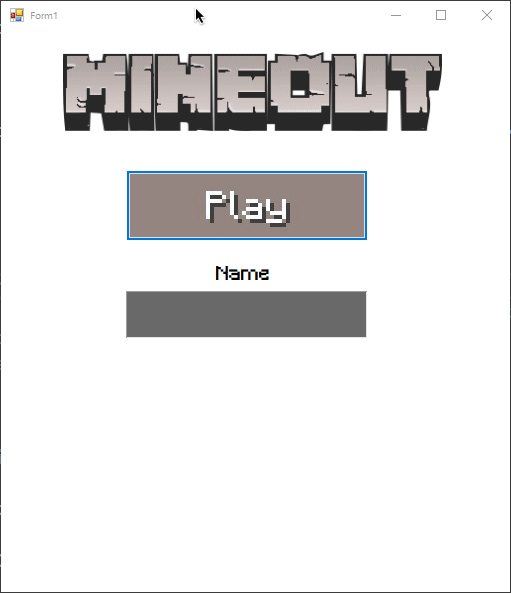

# 🎮 Minecraft-themed Breakout Game

A Windows Forms implementation of the classic Breakout game with a Minecraft twist, featuring pickaxes, ore blocks, and mining sounds.

## ⭐ Features

- Minecraft-styled graphics and sound effects
- Different types of blocks (Iron, Gold, Diamond) with varying durability
- Multiple pickaxes can be spawned during gameplay
- Paddle control with both mouse and keyboard
- High score system with persistent storage
- Progressive difficulty with increasing levels
- Custom Minecraft font integration

## 🎥 Demo



## 🗂️ Project Structure

The main game files are:

- [Form1.cs](Form1.cs) - Main game logic and UI
- [Player.cs](Player.cs) - Player class for score tracking
- [Program.cs](Program.cs) - Application entry point

## 🎯 Game Mechanics

- **Block Types**:
  - Iron Block: Breaks in one hit
  - Gold Block: Requires two hits
  - Diamond Block: Requires three hits

- **Scoring System**:
  - +1 point for hitting a block
  - +2 points for destroying a block
  - High scores are saved to a local file

- **Level Progression**:
  - Speed increases with each level
  - Blocks move down as levels progress
  - Additional pickaxes can spawn during gameplay

## 🚀 Getting Started

1. Clone the repository
2. Open the solution in Visual Studio
3. Ensure you have .NET Framework installed
4. Build and run the project

## 🎮 Controls

- **Mouse**: Move the paddle by moving the mouse
- **Keyboard**: Use Left and Right arrow keys to move the paddle

## 💾 Save System

The game automatically saves high scores to `highScore_list.txt` in the following format:
```
PlayerName: Score
```

## 🔧 Technical Requirements

- Windows OS
- .NET Framework 4.5 or higher
- Visual Studio 2019 or higher

## 🎨 Assets

The game uses custom Minecraft-themed assets:
- Custom Minecraft font
- Block textures (Iron, Gold, Diamond)
- Pickaxe sprite
- Mining sound effects

## 📝 Version History

The game has undergone several iterations with progressive feature additions:
- V.7: Basic paddle movement
- V.8: Ball mechanics and block destruction
- V.10: Timer and menu systems
- V.11: Advanced ball physics
- V.12: Improved block distribution
- V.13: Enhanced block durability
- V.14: Multiple pickaxes and high score system